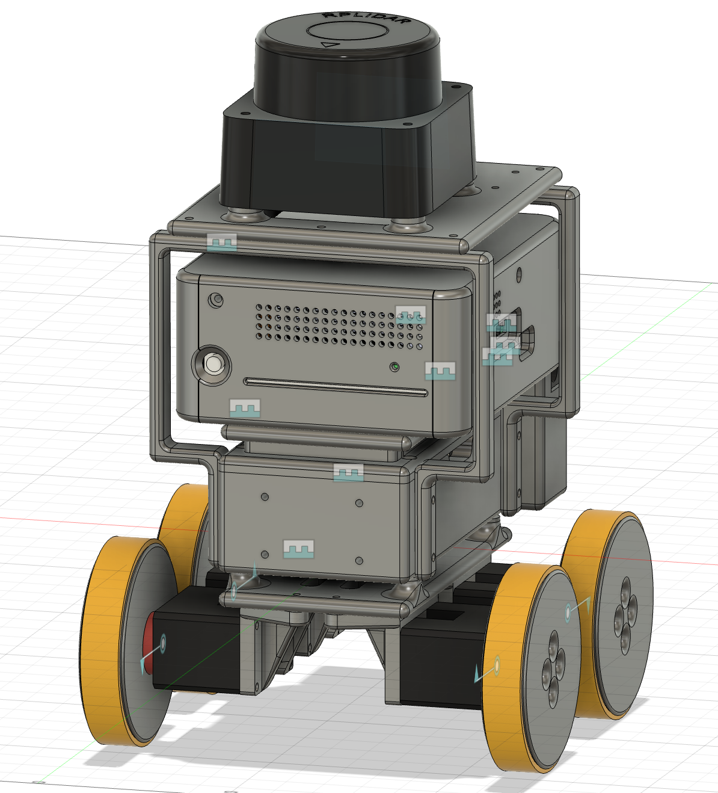
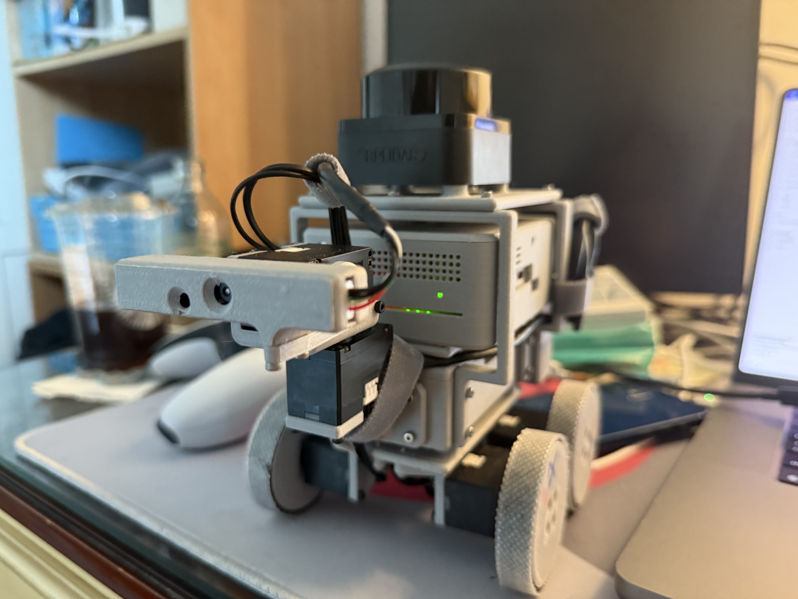

# where are the 3d models ? 
they are inside the 3d_models_mobile_robot.zip, 4Mb, with all step and f3d files, all models verified by printing with bambu lab A1 mini 0.2mm layer standard quality, 0.4 mm nozzle, petg basic (out of production, replace with petg hf, be careful with this filliment, test printing first)
# how to use ROS2 ? 
here are notes and links to offical website for learning about ros2 [ros2 notes and links](https://www.notion.so/ROS2-notes-232b34689cf48064b8feec31d549f96f?source=copy_link) 
## after you set up the project 
on your raspberry pi, run 
```bash
# cd to mobile_robot_nodes workspace
ros2 run actuator_nodes launch_robot.py serial_port:= your u2d2s serial port name

# cd to the computer_nodes workspace, do it in terminal for automatically start rviz2 
ros2 run robot_control launch_control.py

# cd to the sllimatic lidar drivers workspace, which you need prepare by yourself, link is provided in the software requirement sections 
ros2 run sllidar_ros2 sllidar_c1_launch.py serial_port:= your lidars serial port name
```
# what else should I learn ? 
1. numpy
2. scipy
3. oepncv (slightly used for camera, awaiting further development)
4. ubuntu system
# Sofware Requirements
1. this project directly use the offical ros nodes provided by slamtec, which you can get access from github: [slametic officla ros2 node](https://github.com/Slamtec/sllidar_ros2), build from source is required, the basic sdk developed based on the offical python sdk is also included, but not recommended.
2. the imu selected for this project is ICM-20948 module from sparkfun, can be directly install from pip, you can access code examples from github: [sparkfun icm20948 imu codes](https://github.com/sparkfun/Qwiic_9DoF_IMU_ICM20948_Py), since ros2 is hard-coded to use the default python environmet of ubuntu, you should not create virtual environment but directly install it on the ubuntu's environment, since this package is not provided by apt, you can safely override the package conflict protection of apt by add --break-system-package at the end of you pip install commend, but for any dependency you been required to install while compiling this project, try apt install python3-replace_here_with_package_name to making sure it's not provided by apt for avoid conflict, since this device use the i2c bus of raspiberrry pi, you need to add your user to device group for aviod being asked to run under sudo, you will be able to know how to do this by a simple search
3. the joystick control node is developed for ps5 DualSense controller with package pydualsense, you can access through pip just as icm20948 driver, here is the github link: [pydualsense](https://github.com/flok/pydualsense), for make the ps5 DualSense controller been correctely recognized, if just install this package without any further action, you will only be able to run it under root (not sudo), for making sure it does not request for root, you should follow its guide for add device rule, the device rule document you need for adding is included in this repo, named 70-dualsense.rules provided by an github contribuer [dualsense-controller-python repo by yesbotic](https://github.com/yesbotics/dualsense-controller-python) (another option you may try for drive dualsense controller)  you do not need to do any modification on it since its just something about sony and this series of device's identification id
4. for the hardware driver packages, the ones provided in folder without_ros2 is useable, but latency from the once been provided in the ros2 nodes since these are keep optmized during the implementations of ros2 nodes, if need to run things without ros2, copy the folders in the robot_nodes ros2 package with the same name as the ones in without_ros2 is recommended, feel free to help me copy the newer packages out
5. the dynamixel sdk is copyed into this project already, you do not need to install or download it anywhere
6. while flashing system image for raspiberry pi 5, user there offical imager for flashing there offical customized system image to making sure you have all the hardware driver and configuration on the pi been included, this project is developed and tested based on ubuntu24.04, the ros2 version is jazzy, technically support humble packages, but still requre build from soruce code for some cases.
7. the recent implementation usually require 10Mb/s unstream and downstream network transmission through your router
8. if your computer have discrete GPU, run the RVIZ2 on the discrete GPU for achieve a 30fps display(so that it doesn't stuck), there are mutable ways you can do it and easily figure out from quick internet search, and the easiest way is to right click on the "terminal" app and select "run on dedicated GPU" (you have to quit all your opening terminal windows before you are able to reopen them on you discrete GPU)
9. the camera streaming python script is not a ros2 node yet, it just provide basic image streaming though flusk for verification the functionality of the design, you may run it through python3 not ros2 run
